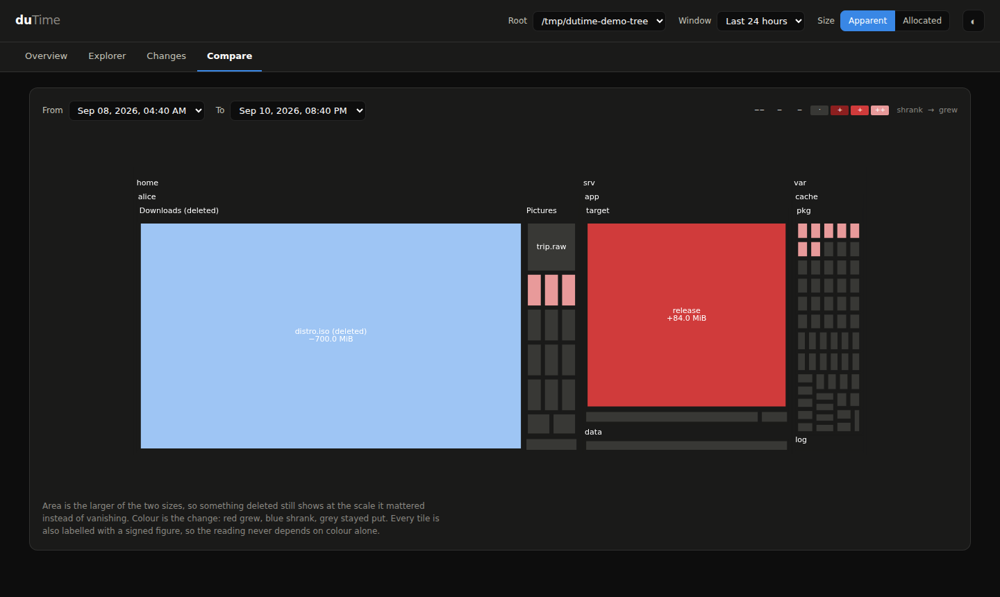
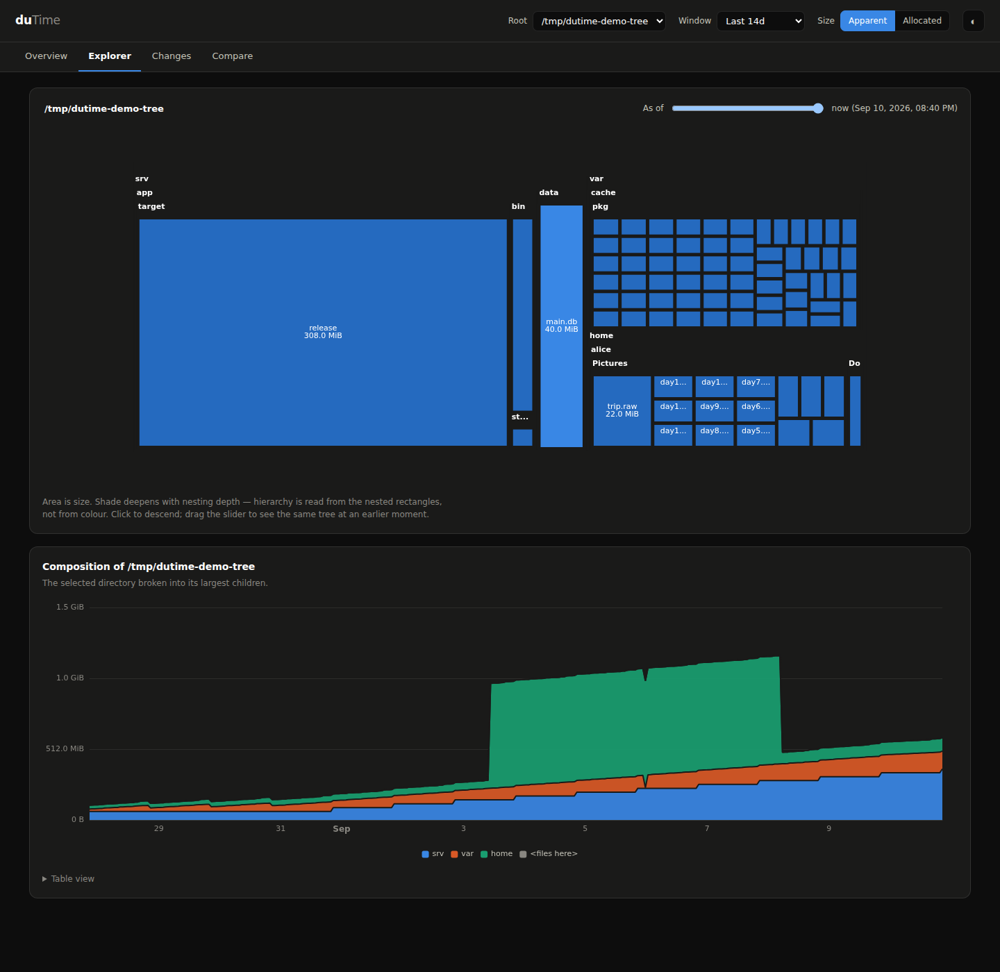

# duTime

**Track disk usage over time.**

`du` tells you what is big *now*. When a disk fills up, that is the wrong
question. A 40 GB directory that has been 40 GB for a year is not why the disk
filled last Tuesday. duTime answers **what grew, and when** — and, just as
usefully, what disappeared.

It runs as a small service on a Linux host, snapshots the directory tree on a
schedule, and serves a web UI you can reach from a headless server.



*Two moments compared. Area is the larger of the two sizes, colour is the
change. The 700 MB download that was deleted is still visible, in blue, at the
size it used to be — a point-in-time `du` today cannot tell you it ever
existed.*

## Why not an existing tool?

| Tool | Gap |
|---|---|
| `du`, `ncdu`, `gdu`, `dust`, `baobab`, QDirStat | Point-in-time only |
| `duc` | Has a database and a web UI, but keeps only the latest scan per path |
| `agedu` | Tracks file *age*, not *growth* — a different question |
| diskover | Elasticsearch + PHP; heavyweight and enterprise-oriented |
| Prometheus dirsize exporters + Grafana | A time-series database has no notion of hierarchy, so subtree aggregation — the whole point — is impossible, and 100k directories as label values is a cardinality explosion |
| TreeSize (Windows, paid) | Can compare two snapshots, but is not a service and not Linux |

## Getting started

```console
$ cargo build --release
$ ./target/release/dutime serve --root "$HOME"
duTime listening on http://127.0.0.1:8471
  tracking /home/steven every 1h
```

Then open <http://127.0.0.1:8471>. On a headless box, forward it:
`ssh -L 8471:localhost:8471 yourserver`.

To install it properly:

```console
$ dutime install --user          # no root, no capabilities, tracks $HOME
$ dutime install --system        # dedicated user + CAP_DAC_READ_SEARCH
```

`install` writes a systemd unit and a starter config, then prints the two
`systemctl` commands — it never enables anything behind your back. The system
unit runs as an unprivileged `dutime` user holding exactly one capability,
never as root, and scores 1.7 on `systemd-analyze security`.

### Deploying to another machine

There is no package yet, so it is build-then-copy:

```console
$ cargo build --release                            # on a build machine
$ scp target/release/dutime yourserver:/tmp/
$ ssh yourserver 'sudo install -m755 /tmp/dutime /usr/bin/dutime'
$ ssh yourserver 'dutime --version'
dutime 0.2.0 (037585ceba 2026-09-11)
```

**Check that last line.** `--version` carries the version, the commit and the
build date,
and `dutime doctor` and the startup log both add the binary's own mtime, so
"is the thing running there the thing I just built?" is answerable rather
than assumed. The commonest reason a fix appears not to work is `cargo build`
having been run without `--release` while `--release` is what gets copied —
the stale binary starts, serves, and behaves exactly like the old one,
because it is the old one.

The binary is dynamically linked and needs a glibc at least as new as the
build machine's (currently 2.39 — Ubuntu 24.04 or later). Copying from a
newer distro to an older one fails at exec with a version error.

**To serve the network, say so at install time:**

```console
$ sudo dutime install --system --listen 0.0.0.0:8471
```

Not by editing `listen` in the config afterwards. The unit ships with
`IPAddressAllow=localhost`, so a config change alone gives you a service that
starts cleanly, reports itself listening, holds a port that `ss` confirms is
open — and drops every packet from the network. `--listen` writes both halves.
See [Troubleshooting](#troubleshooting) if you have already hit this.

## The command line

The CLI is not an afterthought to the web UI — it is what you script against,
and it answers the question on its own.

```console
$ dutime top --since 7d
what grew in the last 7d (exclusive mode)

  +308.0 MiB  /srv/app/target/release/artifact.bin
   +89.4 MiB  /var/cache/pkg
    +5.0 MiB  /home/alice/Pictures/day13.jpg

$ dutime top --since 7d --losers
what shrank in the last 7d (exclusive mode)

  -700.0 MiB  /home/alice/Downloads/distro.iso

$ dutime du /srv --at -3d
1.1 GiB	/srv

$ dutime doctor
sqlite integrity_check       ok
current_size consistency     ok (/home/steven)
reconstruction               ok (recorded 485003831571, fast 485003831571, replay 485003831571)
in-memory snapshot           ok (127501 entities, loaded in 150 ms)
no problems found
```

`top` has two modes. **Exclusive** names the directory whose *own* files grew,
which points straight at the culprit. **Inclusive** rolls growth up the
ancestor chain, and by default hides any directory whose growth is entirely
explained by one child — otherwise a single new file reports itself nine times,
once for every directory above it.

## The web UI

**Overview** — capacity, the tracked tree over time, biggest gainers, and a
days-to-full projection that refuses to guess until it has a real window to
extrapolate from.

**Explorer** — a sortable listing of everything in the current directory with
a **trend sparkline beside each row**, so you can see which of thirty siblings
is the one creeping up before deciding which to open. Then the same directory
decomposed into its largest children as a stacked area. Then a WinDirStat-style
treemap with a time slider; drag it and the same tree redraws as it stood at
that moment. The slider applies to the treemap alone — the panes above it
always show the present.

Each pane reports its own progress — they finish at different times, and a
single page-wide spinner that clears when the last one lands tells you
nothing about which is still working.

Both scales measure **movement**, and differ only in whose movement sets the
height — every row is drawn from its own low point, because the Size column
already answers how big a directory is.

**Per row** gives each row the full height of its own cell and shows *shape*:
a directory quietly doubling from 40 MB looks as dramatic as one adding
400 GB, which is the point when you are hunting for something starting to run
away.

**Shared** takes the largest movement on the page, so that row fills its cell
top to bottom and everything else is drawn to the same ruler — a row that
moved a tenth as much is a tenth as tall. On a volume holding a static 400 GB
archive and a log growing by 21 GB, the log fills the cell and the archive is
a flat rule; an axis anchored at zero would instead render that growth as a
5% wiggle near the top and bury the one row that mattered.

The swing is peak-to-trough rather than first-to-last, and has to be: a
directory that gained 700 GB and gave it back nets zero but still needs the
vertical room, and a scale that ignored it would clip the line out of the
cell. The choice is remembered and travels in the permalink.



**Changes** — biggest gainers and losers over any window, exclusive or
inclusive, exportable as CSV.

**Compare** — the diff treemap at the top of this page.

Every view is linkable: the URL carries the path, window and comparison, so you
can paste exactly what you are looking at into a ticket. A status line at the
foot of the page names the build that is answering, when that binary was
built, and how much disk the database is using — a tool that reports on disk
usage should say what it costs.

## How it works

A scheduled walk, a change-only event log, and an in-memory rollup.

**Change-only storage.** A row means "this entity's size became X at this
scan"; no row means unchanged. On a live 448 GiB home directory with 884k
files, the baseline snapshot is 127,496 entities in a 20 MB database and every
scan after it records **2–10 events**.

**Exclusive sizes, inclusive by rollup.** Mean directory depth is ~9.3, so
storing inclusive sizes would dirty ~9.3 rows per single file write. Storing
exclusive sizes dirties one, and the rollup that recovers inclusive values is
an in-memory pointer walk.

**SQLite, deliberately.** At a few hundred MB a year, the columnar and
server-based options solve a problem that does not exist while charging real
operational cost — and a time-series database cannot do subtree aggregation at
all. See [docs/storage.md](docs/storage.md) for the full comparison.

**Both size metrics, always.** Apparent (`st_size`) and allocated
(`st_blocks × 512`) are tracked separately everywhere. Their divergence is
signal: sparse VM images have far fewer blocks than bytes, and a pile of tiny
files has more blocks than bytes from per-file tail slack.

## Correctness

duTime's numbers are only worth anything if you can check them, so the test
suite pins them to `du` byte for byte — including hardlinks, sparse files,
symlinks, non-UTF-8 filenames, and files straddling the tracking threshold.

Verified against a real 11 GB `/usr`: apparent and allocated totals both match
`du` exactly. `dutime doctor` cross-checks three independent implementations of
history reconstruction — the fast checkpoint+delta path, a naive full replay,
and the in-memory rollup — against the value recorded at scan time.

```console
$ cargo test
```

Two things `du` does that are surprising, and that duTime replicates because
being checkable matters more than being tidy:

- `du --apparent-size` does **not** count a directory's own `st_size`, while
  allocated `du` **does** count its `st_blocks`.
- `du -a` omits de-duplicated hardlinks from its listing entirely.

Where duTime deviates, it does so on purpose: hardlink de-duplication credits
the lowest-sorting path rather than whichever link the walk reached first, so
two scans of an unchanged tree agree instead of inventing growth.

## Configuration

```console
$ dutime config > /etc/dutime/config.toml
```

Scanning defaults to **hourly**, not five-minutely. Every timing here is from a
warm cache; the first walk after a reboot has to fault in a gigabyte of
dentries and inodes and will be far slower. Measure a cold scan on the machine
in question before turning the interval down.

Exclusions use gitignore syntax, but duTime deliberately never reads
`.gitignore` files off disk — `target/` and `node_modules/` are precisely what
you are trying to find.

**Tracking several directories** means several `[[root]]` blocks. The name in
brackets is a fixed field name, not a label you choose, so `[[media]]` is
rejected:

```toml
[[root]]
path = "/"
interval_s = 3600

[[root]]
path = "/mnt/media"
interval_s = 3600
```

Each root is scanned, stored and checkpointed independently — different
intervals and thresholds per root are fine — and the web UI gets a picker to
switch between them.

Check a file before restarting anything:

```console
$ dutime config --check /etc/dutime/config.toml
```

It prints the resolved settings rather than only reporting the absence of an
error: the defaults that get filled in are not visible in the file, and a
config that parses can still track a directory you did not mean. It warns
about a root nested inside another (legal, but its bytes are then counted
under both) and exits non-zero if a root does not exist.

### Protecting sensitive roots

duTime shows filenames, and on a volume like a Nextcloud data directory the
*filenames* are the sensitive part regardless of who owns the bytes. So
protection is per root, not per server:

```toml
[auth]
token_file = "/etc/dutime/token"

[[root]]
path = "/"                     # anyone on the LAN can see this

[[root]]
path = "/mnt/nextcloud"
protected = true               # needs the token
```

```console
$ sudo dutime token --write /etc/dutime/token
```

Then open the UI and click the lock in the header. The token is verified
before it is stored, so a typo is reported there and then rather than as a
broken dashboard later, and it is remembered in that browser across reloads.

An anonymous visitor sees the unprotected roots normally and **is not told
the protected ones exist** — they are absent from the root picker and from
`/api/v1/roots`, because a path like `/mnt/nextcloud/data/steven` is itself
information. Asking for one by id returns 401 regardless of how the request
is otherwise formed.

Two mistakes are caught rather than tolerated. A root marked `protected` with
no token configured **refuses to start**, because a config that claims to
protect something while protecting nothing is worse than either. And serving
a non-loopback address with nothing protected logs a warning.

The token rides in an `Authorization` header, not a cookie: a cookie is
attached by the browser to any request to this origin, including one a page
elsewhere triggered, which is what CSRF is. Nothing is hashed or salted
because nothing needs to be — it is one 256-bit random string from the kernel
CSPRNG, compared in constant time. There are deliberately no accounts: user
tables, password hashing, sessions and a reset flow are a great deal of
security-sensitive surface for a single-operator tool.

**What this is not.** It is not a defence against someone who can read
`/var/lib/dutime/dutime.db`, and the traffic is plain HTTP, so anyone able to
watch the network sees the token. For untrusted networks, bind loopback and
use an SSH tunnel.

### Reading directories duTime does not own

**On a local filesystem, do not run it as root.** The system unit already
grants `CAP_DAC_READ_SEARCH`, which bypasses read and traverse checks and
grants nothing else — no write, no chown, no module loading. A `chmod 700`
directory owned by another user is readable with it, and root would add only
the ability to damage something.

**On NFS, SMB or another network share, that capability does nothing at all.**
The check happens on the *server*, against the numeric uid and gid the client
presents — `sec=sys` sends exactly that and nothing else — and the server
cannot see a capability held by a process on your machine. `root_squash` is
the default on nearly every export, so running as root maps to `nobody` and
reads *less* than an ordinary user. The only thing that helps is making the
uid match: run duTime as the user that owns the files, or grant duTime's uid
access on the server. For a mode-700 directory no group membership will do
it either, since 700 grants nothing to the group.

duTime works this out for itself: it records the filesystem type of each root,
names that type in the advice it prints, and — when the owner is the problem —
names both uids, so the fix is a single edit rather than two lookups:

```
this root is on nfs4, where permissions are enforced by the SERVER against the
uid/gid duTime presents … Here that means: duTime runs as uid 998, this root is
owned by uid 33 with mode 0700, which grants group and other nothing, so only
that uid can read it. Set `User=` in `systemctl edit dutime` to the account
with uid 33.
```

A note on NFS export squashing, since it is the setting people reach for
first: squashing only *remaps* uids. "No mapping" (`no_root_squash`) passes
every uid through unchanged, which is what you want when matching the uid —
but on its own it grants duTime nothing, because its uid still is not the
owner's. "Map all users to admin" (`all_squash` with `anonuid`) would grant
access, at the price of every client on that export reading as the owner.

```console
$ systemctl show dutime -p AmbientCapabilities
AmbientCapabilities=cap_dac_read_search
```

If that is empty you are running the `--user` unit, which deliberately has no
capabilities and can only see what you can. Reinstall with
`sudo dutime install --system`.

Two other things stop a directory being scanned, and neither is a permission:

- **A separate mount.** `one_filesystem = true` means a scan of `/` stops at
  the mount boundary, so a data drive needs its own `[[root]]`.
- **An exclude.** `dutime config --check` lists what applies to each root.

**A root whose data is on a mount below it is never silent.** With
`one_filesystem = true` (the default) a scan stops at each filesystem
boundary, so a root at `/media/nextcloud` whose data drive is mounted at
`/media/nextcloud/data` records the directory and nothing else. The daemon now
names the filesystems it declined to cross, and a scan that comes back with
almost nothing prints the candidate reasons — unreadable paths, crossed
mounts, excludes, the file threshold — with what that scan actually observed
against each. `dutime scan <root> --dry-run` shows the same from the CLI; run
it as the service user (`sudo -u dutime`) or you are testing your own
permissions rather than duTime's.

**An unreadable path is never silent.** Everything beneath it is simply absent
from the total, which is indistinguishable from a real shrink unless somebody
says so — so the scan is recorded as `partial`, the daemon logs a warning
naming the paths, and the Overview carries a banner. Partial scans still
appear in history: the totals are an underestimate, but the same paths
usually fail every time, so the trend remains meaningful.

## Troubleshooting

### The service is running but the page just spins

A spinning tab that never errors means packets are being **dropped** rather
than refused. A refusal is instant and produces a message; a drop produces
nothing at all, which is why the logs look healthy. Ask duTime:

```console
$ sudo dutime doctor --config /etc/dutime/config.toml
```

It prints the bound address, what systemd's IP filter will actually let
through, the result of connecting to itself, and every URL this host answers
on. In order of how often each is the culprit:

1. **`IPAddressAllow=localhost` in the unit.** The single most likely cause,
   and duTime's own fault: the hardened unit is loopback-only, so setting
   `listen = "0.0.0.0:8471"` in the config and nothing else leaves the filter
   dropping everything. `doctor` reports this as a `PROBLEM` naming both
   settings. Fix with `sudo dutime install --system --listen 0.0.0.0:8471`
   (then `daemon-reload` and `restart`), or narrow it yourself with
   `sudo systemctl edit dutime` and an `IPAddressAllow=192.168.0.0/16` line.
2. **Bound to loopback.** `listen = "127.0.0.1:8471"` is the default and is
   working as designed. Either tunnel it —
   `ssh -N -L 8471:localhost:8471 yourserver` — or bind the network as above.
3. **A host firewall.** `sudo ufw allow 8471/tcp`. Note that duTime's
   self-check cannot see this one: a packet to one of this host's own
   addresses is routed over loopback and never meets the firewall, so the
   probe passing does not prove a remote client can connect. `doctor` says so
   where it reports the result.
4. **`https://` in the address bar.** duTime speaks plain HTTP. A TLS
   handshake against a plaintext port hangs exactly like a dropped packet.

To see whether requests arrive at all, turn on the access log — one line per
request, in and out:

```console
$ sudo systemctl edit dutime      # [Service] Environment=DUTIME_ACCESS_LOG=1
$ sudo systemctl restart dutime && journalctl -fu dutime
```

Requests logged but never answered is a different bug from no requests at all,
and that distinction is usually the whole diagnosis. (`access_log = true` in
the config does the same thing.)

### A very large root is slow to open

Scale is entity count, not disk size. Measured on a synthetic 1.3M-entity
volume (`cargo run --release --example bench_large`), opening the Explorer
after a root change:

| | before | after |
|---|---|---|
| treemap | 2.0 s | 2.0 s cold, 0.08 s warm |
| **Contents**, ordinary window | **2.3 s** | **0.012 s** |
| **Contents**, window containing a baseline scan | **12 s** | **0.62 s** |
| **stacked area**, ditto | **7.5 s** | **0.64 s** |

The second and third rows are the case that bites once a volume has been
scanned for the first time. That scan emits one event per entity — 1,463,512
on a real Nextcloud volume — and every window containing it has to account for
all of them. Both panes used to resolve each event to a child by climbing its
ancestors with a database lookup per level; they now walk *down* the subtree
once, so each event is an array index, and the event index covers the delta
columns so reading a window is a single sequential scan.

The Contents pane was materialising the whole tree a *second* time just to
learn each child's size at the start of the window; it now derives that from
the size at the end minus the window's own events, which is the invariant the
store is built on. The stacked area was reconstructing each band's starting
total with a recursive walk of every descendant — a million rows, nine times
per request — and does the same thing now instead. Both also built a
`path_id -> parent_id` map of the entire root on every request; they climb
from the few hundred events in the window instead.

What remains is the treemap's 2 s, and that one is real: a treemap has to lay
out the whole tree, so the whole tree has to be resident. It is paid once per
root and cached after.

**Memory scales with entities** — roughly 180 bytes each plus allocator
overhead, so ~250 MB for 500k and ~1 GB for 2.3M. The snapshot cache is
bounded in bytes rather than in snapshots for that reason, and the system unit
allows 2 GB. `dutime doctor` reports the entity count if you want to size it
down.

### A scan is running and the UI feels slow

It should not block. The walk and the commit both run off the request threads,
and reads come from a pool of connections separate from the writer. Worst-case
API latency during a scan is ~160 ms. If you see seconds, open an issue with
`dutime doctor` output.

## Status

Working: scanner, store, query layer, CLI, daemon, REST API, web UI.
Released versions and what changed in each: [CHANGELOG.md](CHANGELOG.md).

Not yet: retention tiering (unnecessary at current volumes — see
[docs/storage.md](docs/storage.md)), move detection, alerting, and fleet
aggregation.

## License

MIT
